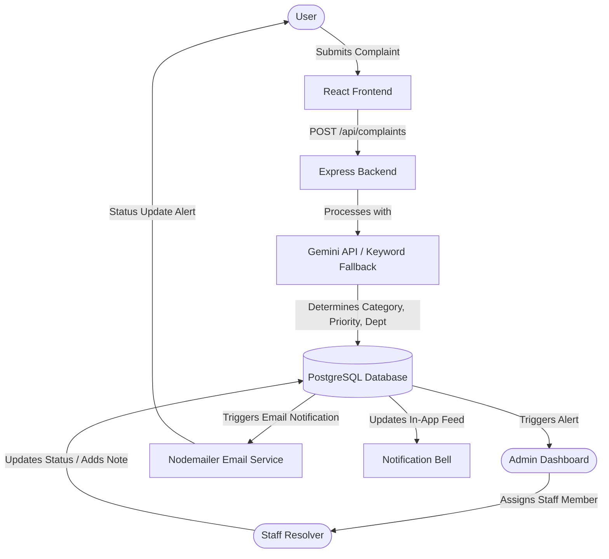
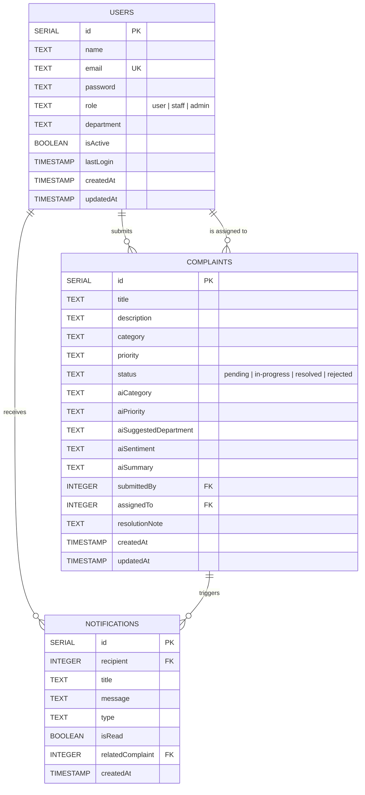

# 🚀 CaseTrack - Smart Complaint Management System

CaseTrack is a full-stack, enterprise-grade **Smart Complaint Management System** designed to streamline, categorize, and track grievances within organizations. Featuring role-based dashboards, automated AI-powered complaint classification, email updates, and real-time in-app notifications, CaseTrack turns manual ticket resolution into an automated, transparent, and structured workflow.

---

## 🏗️ System Architecture & Workflow

CaseTrack implements a highly secure, role-restricted dashboard for three distinct types of users:

1. **Users (Complainants):** Can register, log in, submit complaints with text descriptions, and track the status/resolution of their tickets in real time.
2. **Staff (Resolvers):** Assigned to specific departments. They can view tickets assigned to them, manage ticket states (`in-progress`, `resolved`, `rejected`), and write resolution notes.
3. **Admins (Managers):** Complete overview of all complaints. Admins assign pending tickets to appropriate staff members, manage system-wide users, create new admin accounts, and view global analytics.

### 🔄 Complaint Resolution Pipeline (Workflow)



### 🗄️ Database Schema ERD



---

## 🛠️ Technology Stack

### Backend
- **Core Engine:** Node.js, Express.js
- **Database:** PostgreSQL (using `pg` pool, automatic schema setup and key camelization on boot)
- **Authentication & Security:** JSON Web Tokens (JWT), BcryptJS for password hashing, Helmet for secure HTTP headers, Express-Rate-Limit for API rate limiting
- **AI Core:** Google Gemini API (`@google/generative-ai`) with a robust keyword-based local classifier fallback to ensure 100% uptime even if API quotas are exhausted
- **Notification Services:** Nodemailer (SMTP integration for automated confirmation, assignment, and resolution alerts)

### Frontend
- **Framework & Build Tool:** React 19, Vite, ES6+ JavaScript
- **Styling Engine:** Tailwind CSS v4 (offering high-speed layouts and clean, modern themes)
- **Navigation:** React Router DOM (v7)
- **Analytics & Data Vis:** Recharts (rendering dynamic charts for complaint categories, priority shares, resolution rates)
- **User Alerts:** React Hot Toast (beautiful responsive notifications)
- **HTTP Client:** Axios (configured with global interceptors for JWT injection and automated 401 session logout)

---

## 📂 Project Directory Structure

```
CaseTrack/
├── backend/
│   ├── config/
│   │   └── db.js                 # PostgreSQL config, table schema initialization & key camelization
│   ├── controllers/
│   │   ├── authController.js     # Auth routines: Login, register, profile, user managers
│   │   ├── complaintController.js  # Complaint management: submit, assign, status update, delete
│   │   ├── dashboardController.js # Aggregations for Recharts visualizations
│   │   └── notificationController.js # Read/delete operations for user alert feed
│   ├── middleware/
│   │   └── auth.js               # JWT verification & role protection middleware
│   ├── models/                   # Deprecated (moved to database configuration setup)
│   ├── routes/
│   │   ├── authRoutes.js
│   │   ├── complaintRoutes.js
│   │   ├── dashboardRoutes.js
│   │   └── notificationRoutes.js
│   ├── utils/
│   │   ├── emailService.js       # SMTP config & html layout handlers
│   │   └── geminiAI.js           # Gemini API interface with local fallback rules
│   ├── .env.example              # Template configuration for environment settings
│   ├── package.json
│   └── server.js                 # Entry point: Server settings, limits, helmet & health check
├── frontend/
│   ├── public/                   # Static client resources
│   ├── src/
│   │   ├── components/
│   │   │   ├── ComplaintForm.jsx # Standardized user form for submitting cases
│   │   │   ├── Navbar.jsx        # Dynamic role-responsive header navigation bar
│   │   │   ├── NotificationBell.jsx # Sidebar dropdown with current notifications
│   │   │   └── ProtectedRoute.jsx  # Guard routing wrapper
│   │   ├── context/
│   │   │   └── AuthContext.jsx   # Top-level global auth session state provider
│   │   ├── pages/
│   │   │   ├── AdminDashboard.jsx # Admin control board, assignments panel, user controls, charts
│   │   │   ├── Login.jsx
│   │   │   ├── Register.jsx
│   │   │   ├── StaffPanel.jsx     # Staff resolver terminal
│   │   │   ├── UserDashboard.jsx  # Complainant portal to review status
│   │   │   └── NotFound.jsx       # Fallback 404 page
│   │   ├── utils/
│   │   │   └── api.js            # Axios client setup (interceptor-wrapped)
│   │   ├── App.jsx               # Application route mappings & styles wrapper
│   │   └── index.css             # Tailwind v4 import & global styles
│   ├── package.json
│   └── vite.config.js
└── README.md                     # Project documentation
```

---

## 🚀 Installation & Local Setup

Follow these steps to set up CaseTrack on your local environment:

### Prerequisites
- **Node.js** (v18.x or higher)
- **PostgreSQL** instance (local server or cloud host like Neon / Supabase)
- **Google Gemini API Key** (optional, fallback is automatically used if absent)
- **SMTP Server / Credentials** (e.g., Gmail App Password for email dispatches)

### Step 1: Clone the Repository
```bash
git clone https://github.com/your-username/CaseTrack.git
cd CaseTrack
```

### Step 2: Configure the Backend Environment
1. Navigate to the `backend` folder:
   ```bash
   cd backend
   ```
2. Copy the example environment template:
   ```bash
   cp .env.example .env
   ```
3. Open `.env` and fill in your details:
   ```env
   PORT=5000
   DATABASE_URL=postgresql://<user>:<password>@<host>:<port>/<dbname>?sslmode=require
   JWT_SECRET=your_jwt_secret_here
   GEMINI_API_KEY=your_gemini_api_key_here
   EMAIL_USER=your_email_user@gmail.com
   EMAIL_PASS=your_gmail_app_password
   NODE_ENV=development
   ```

### Step 3: Run the Backend
1. Install backend dependencies:
   ```bash
   npm install
   ```
2. Start the development server (runs auto-watch modes):
   ```bash
   npm run dev
   ```
   *Note: Upon successful connection, the tables will be created automatically in your PostgreSQL database.*

### Step 4: Run the Frontend
1. Open a new terminal window and navigate to the `frontend` folder:
   ```bash
   cd frontend
   ```
2. Install frontend dependencies:
   ```bash
   npm install
   ```
3. Start the Vite development server:
   ```bash
   npm run dev
   ```
4. Open [http://localhost:5173](http://localhost:5173) in your web browser.

---

## 📡 API Endpoint Reference

### Authentication (`/api/auth`)
| HTTP Method | Endpoint | Access Level | Description |
| :--- | :--- | :--- | :--- |
| **POST** | `/api/auth/register` | Public | Register a new User account |
| **POST** | `/api/auth/login` | Public | Authenticate user & return JWT token |
| **GET** | `/api/auth/profile` | Authenticated | Fetch active user credentials |
| **PUT** | `/api/auth/profile` | Authenticated | Edit user personal information |
| **GET** | `/api/auth/users` | Admin | Retrieve all registered users |
| **PUT** | `/api/auth/users/:id` | Admin | Edit roles, activation state or details of a user |
| **GET** | `/api/auth/staff` | Admin | Retrieve all members with 'staff' role |
| **POST** | `/api/auth/create-admin`| Admin (only) | Provision a new Admin account |

### Complaints (`/api/complaints`)
| HTTP Method | Endpoint | Access Level | Description |
| :--- | :--- | :--- | :--- |
| **POST** | `/api/complaints` | User | Submit a new complaint (auto-analyzed) |
| **GET** | `/api/complaints/my` | User | Fetch complaints submitted by active user |
| **GET** | `/api/complaints` | Admin, Staff | Retrieve all system complaints (Staff: only assigned) |
| **GET** | `/api/complaints/:id` | Authenticated | Retrieve specific complaint details |
| **PUT** | `/api/complaints/:id/status`| Admin, Staff | Update status & add resolution notes |
| **PUT** | `/api/complaints/:id/assign`| Admin | Assign a complaint to a specific Staff resolver |
| **DELETE** | `/api/complaints/:id` | Admin | Permanently delete a complaint |

### Notifications (`/api/notifications`)
| HTTP Method | Endpoint | Access Level | Description |
| :--- | :--- | :--- | :--- |
| **GET** | `/api/notifications` | Authenticated | Retrieve notification feed for active user |
| **PUT** | `/api/notifications/read-all`| Authenticated | Mark all notifications as read |
| **PUT** | `/api/notifications/:id/read`| Authenticated | Mark a specific notification as read |
| **DELETE** | `/api/notifications` | Authenticated | Wipe notification feed completely |
| **DELETE** | `/api/notifications/:id` | Authenticated | Delete a single notification from feed |

### Dashboard Analytics (`/api/dashboard`)
| HTTP Method | Endpoint | Access Level | Description |
| :--- | :--- | :--- | :--- |
| **GET** | `/api/dashboard/stats` | Authenticated | Returns analytics & aggregation datasets |

---

## 🔒 Security Best Practices Implemented
- **XSS & HTTP Header Protections:** Configured through Helmet middleware.
- **DDoS/Brute-Force Shielding:** Standard endpoints restricted to 200 requests/15 mins; Authentication endpoints capped at 50 requests/15 mins.
- **SQL Injection Prevention:** Parameterized SQL queries utilized across all database operations.
- **Access Route Guards:** Custom Router wrapper (`ProtectedRoute`) on client and middleware check validation (`protect`, `authorize`) on the API layer.

---

## 📄 License
This project is licensed under the ISC License. Feel free to fork, modify, and distribute as needed.